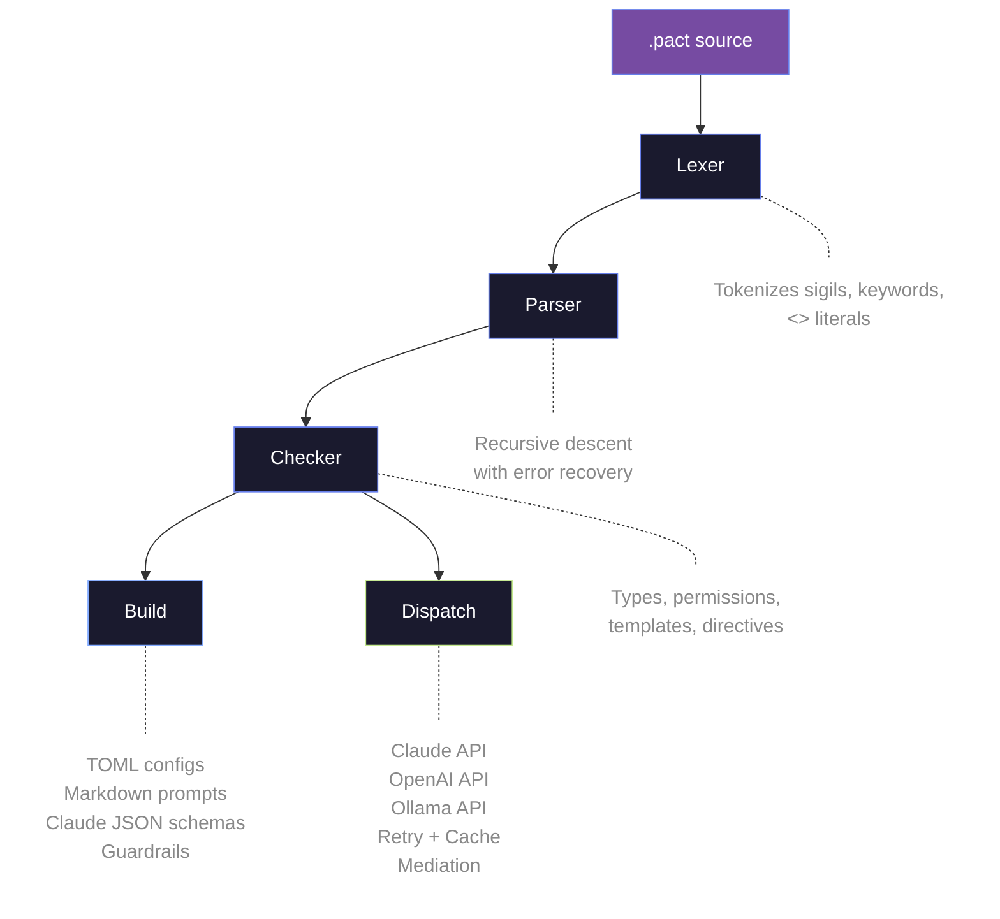
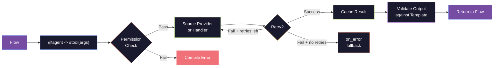

<div align="center">


# PACT

### Programmable Agent Contract Toolkit

A typed, permission-enforced language for orchestrating AI agents.

[](https://github.com/Pact-Lang/pact/actions/workflows/ci.yml)
[](https://crates.io/crates/pact-lang)
[](LICENSE)
[](https://github.com/Pact-Lang/pact)

[Website](https://pactlang.dev) &bull; [Get Started](#quick-start) &bull; [Examples](#examples) &bull; [Docs](#cli-reference) &bull; [Contributing](CONTRIBUTING.md)

</div>

---

PACT is a **language**, not a library. Where frameworks bolt safety onto Python after the fact, PACT encodes permissions, types, and agent contracts directly into its syntax. Every tool declares what it needs. Every agent declares what it may do. The compiler enforces the rest -- before a single API call is made. The result: AI agent systems you can reason about, audit, and trust.

## Why PACT?

| | PACT | LangChain | CrewAI | AutoGen |
|---|---|---|---|---|
| Language vs Library | **Language** | Python lib | Python lib | Python lib |
| Type safety | **Built-in** (`::`) | None | None | None |
| Permission system | **First-class** (`^`) | Manual | None | None |
| Agent contracts | **Enforced at compile-time** | Runtime only | Runtime only | Runtime only |
| Composable prompts | **Templates + Directives** | String concatenation | String templates | String templates |
| Source providers | **Declarative** (`source:`) | Raw HTTP calls | Manual | Manual |
| Auto-guardrails | **GDPR, HIPAA, PCI-DSS** | Manual | None | None |
| Multi-backend | **Claude, OpenAI, Ollama** | Many | OpenAI | Many |
| Tooling | **LSP, VS Code, formatter** | IDE plugins | None | None |

## Quick Start

```bash
# Install via Cargo
cargo install pact-lang

# Or via Homebrew (macOS / Linux)
brew tap pact-lang/tap && brew install pact-lang
```

```bash
# Scaffold a new project
pact init my_agent.pact

# Type-check a contract
pact check examples/hello_agent.pact

# Run with Claude
export ANTHROPIC_API_KEY=sk-...
pact run examples/website_builder.pact --flow build_bilingual_site \
  --args "coffee shop in Uppsala, Sweden" --dispatch claude

# Format code
pact fmt examples/hello_agent.pact --write

# Generate docs
pact doc examples/website_builder.pact -o docs.md

# Interactive playground
pact playground --load examples/research_flow.pact
```

## The Language at a Glance

A complete, working PACT program -- a research agent that searches the web, summarizes findings, and drafts a report:

```pact
permit_tree {
    ^net  { ^net.read }
    ^llm  { ^llm.query }
}

tool #web_search {
    description: <<Search the web for a query.>>
    requires: [^net.read]
    source: ^search.duckduckgo(query)
    params { query :: String }
    returns :: List<String>
}

tool #summarize {
    description: <<Condense content into key points.>>
    requires: [^llm.query]
    params { content :: String }
    returns :: String
}

agent @researcher {
    permits: [^net.read, ^llm.query]
    tools: [#web_search, #summarize]
    model: "claude-sonnet-4-20250514"
    prompt: <<You are a thorough research assistant.>>
}

flow research(topic :: String) -> String {
    results = @researcher -> #web_search(topic)
    summary = @researcher -> #summarize(results)
    return summary
}
```

Every symbol in PACT carries meaning through its sigil.

### Sigils -- Everything has a Symbol

| Sigil | Meaning | Example |
|-------|---------|---------|
| `@` | Agent | `@researcher` |
| `#` | Tool | `#web_search` |
| `$` | Skill | `$summarize` |
| `~` | Memory | `~conversation` |
| `^` | Permission | `^net.read` |
| `%` | Template / Directive | `%report_format` |

### Type Safety -- Catch Errors Before They Run

Every parameter, return value, and variable in PACT has a type. The compiler validates types at compile time -- no runtime surprises.

```pact
-- Parameters and returns are typed with ::
tool #analyze {
    params {
        data :: String
        count :: Int
        tags :: List<String>
    }
    returns :: String
}

-- Flow signatures are typed
flow process(input :: String, limit :: Int) -> String {
    result = @agent -> #analyze(input, limit, ["tag1"])
    return result
}
```

Built-in types: `String`, `Int`, `Float`, `Bool`, `List<T>`, `Map<K,V>`, `Optional<T>`, `Record`, `Any`

The type checker also infers variable types from assignments. If a variable is assigned a `String` and later reassigned an `Int`, the compiler warns:

```
  w variable 'result' was inferred as String but is being assigned Int
   ,---[pipeline.pact:5:5]
 5 |     result = 42
   .     ---+---
   .        `-- incompatible reassignment
   `----
```

Types flow through the entire program: tool return types propagate to variables, flow parameters are validated at call sites, and template fields enforce their declared types.

### Permissions -- Security by Default

Permissions are not an afterthought. They are part of the grammar. If an agent uses a tool it lacks permission for, the compiler rejects the program:

```pact
agent @writer {
    permits: [^llm.query]          -- only LLM access
    tools: [#save_to_disk]         -- tries to use a file tool
}

tool #save_to_disk {
    requires: [^fs.write]          -- needs filesystem write
    params { content :: String }
    returns :: String
}
```

```
  x agent '@writer' uses tool '#save_to_disk' which requires permission 'fs.write',
  | but the agent does not have it
   ,---[contract.pact:3:13]
 3 |     tools: [#save_to_disk]
   .             ------+------
   .                   `-- tool used here
   `----
  help: add '^fs.write' to the agent's permits list
```

This is caught at **compile time** -- before any API call, before any file is touched.

### Templates -- Structured Output

Templates define reusable output schemas that tools must conform to:

```pact
template %website_copy {
    HERO_TAGLINE :: String      <<one powerful headline>>
    HERO_SUBTITLE :: String     <<one compelling subtitle>>
    ABOUT :: String             <<two paragraphs about the business>>
    MENU_ITEM :: String * 6     <<Name | Price | Description>>
}

tool #write_copy {
    description: <<Write marketing copy for a website.>>
    requires: [^llm.query]
    output: %website_copy
    params { brief :: String }
    returns :: String
}
```

### Directives -- Composable Prompts

Directives are reusable prompt blocks with typed parameters. Attach them to tools to compose complex behavior from small, testable pieces:

```pact
directive %scandinavian_design {
    <<Use Google Fonts ({heading_font} for headings, {body_font} for body).
    Rich color palette matching a Scandinavian brand.>>
    params {
        heading_font :: String = "Playfair Display"
        body_font :: String = "Inter"
    }
}

tool #generate_html {
    description: <<Generate a one-page HTML website.>>
    requires: [^llm.query]
    directives: [%scandinavian_design, %scroll_animations]
    params { content :: String }
    returns :: String
}
```

### Source Providers -- No More Raw URLs

Instead of embedding HTTP endpoints in handler strings, declare what a tool needs and let PACT resolve it:

```pact
-- Before: fragile, hardcoded URL
tool #search {
    handler: "http GET https://api.duckduckgo.com/?q={query}&format=json"
    ...
}

-- After: declarative source provider
tool #search {
    source: ^search.duckduckgo(query)
    ...
}
```

Providers are built-in, tested, and carry their own permission requirements. Swap `^search.duckduckgo` for `^search.brave` without changing anything else.

### Flows -- Multi-Agent Orchestration

Flows chain agents together with dispatch (`->`), pipelines (`|>`), and fallbacks (`?>`):

```pact
flow build_bilingual_site(request :: String) -> String {
    -- Chain agents with dispatch
    research = @researcher -> #research_location(request)
    english  = @researcher -> #write_copy(research)
    swedish  = @translator -> #translate_to_swedish(english)
    html     = @designer   -> #generate_html(swedish)
    return html
}

flow safe_search(query :: String) -> String {
    -- Fallback: if primary fails, try backup
    result = @researcher -> #web_search(query) ?> @writer -> #draft_report(query)
    return result
}
```

## Examples

| File | Description |
|------|-------------|
| [`hello_agent.pact`](examples/hello_agent.pact) | Minimal agent with a single tool and flow |
| [`research_flow.pact`](examples/research_flow.pact) | Multi-agent research with fallback chains |
| [`website_builder.pact`](examples/website_builder.pact) | Bilingual website generator with templates, directives, and source providers |
| [`rag_pipeline.pact`](examples/rag_pipeline.pact) | Retrieval-augmented generation with citations and quality checking |
| [`code_review.pact`](examples/code_review.pact) | AI-powered code reviewer with security analysis |
| [`customer_support.pact`](examples/customer_support.pact) | Intent classification with match expressions and memory |
| [`data_analyst.pact`](examples/data_analyst.pact) | Data pipeline with fetch, clean, and insight generation |
| [`ci_agent.pact`](examples/ci_agent.pact) | CI/CD pipeline agent with shell execution |
| [`age_verified_website.pact`](examples/age_verified_website.pact) | Age-gated content with compliance guardrails |

Run any example:

```bash
pact check examples/hello_agent.pact
pact run examples/hello_agent.pact --flow hello --args "world" --dispatch claude
```

## Automatic Guardrails

PACT detects compliance domains from your permission declarations and injects security boundaries into agent prompts at build time -- no manual boilerplate:

| Domain | Trigger | Standards |
|--------|---------|-----------|
| Personal Data | `^data.read`, `^data.write` | GDPR, CCPA |
| Age Verification | `^user.age_check` | COPPA |
| Financial Data | `^payment.read`, `^payment.write` | PCI-DSS |
| Health Data | `^health.read`, `^health.write` | HIPAA |
| Credentials | `^auth.read`, `^auth.write` | Secret masking |

Write 10 lines of PACT. Get production-grade guardrails for free.

## Architecture

### Compiler Pipeline



### Agent Execution Flow



Seven crates, one workspace:

| Crate | Purpose |
|-------|---------|
| `pact-core` | Lexer, parser, AST, checker, interpreter, formatter, docs |
| `pact-build` | Build pipeline: TOML, Markdown, Claude JSON, guardrails |
| `pact-dispatch` | Runtime: API clients, tool execution, retry, cache, mediation |
| `pact-cli` | CLI binary: check, run, fmt, doc, playground |
| `pact-lsp` | Language Server Protocol for editor integration |
| `pact-mermaid` | Bidirectional Mermaid diagram conversion |
| `pact-mcp` | Model Context Protocol server |

## Editor Support

### VS Code

The `pact-lang` VS Code extension gives you a full development environment for `.pact` files.

**What you get:**

- Syntax highlighting for all sigils (`@`, `#`, `$`, `~`, `^`, `%`), keywords, types, and `<<prompt>>` literals
- Parameter interpolation highlighting inside prompts (`{param_name}`)
- Section label highlighting inside prompts (`DESIGN:`, `LAYOUT:`)
- Real-time error diagnostics with source locations and fix suggestions
- Hover information for agents, tools, templates, directives, and permissions
- Auto-completion for sigils, keywords, types, and references
- Go-to-definition support

**Install from source:**

```bash
# 1. Build the LSP server
cd /path/to/pact
cargo build --release --bin pact-lsp

# 2. Build the VS Code extension
cd editors/vscode
npm install
npm run compile

# 3. Package as VSIX
npx vsce package

# 4. Install in VS Code
#    Cmd+Shift+P > "Extensions: Install from VSIX" > select the .vsix file
```

**Configure the LSP:**

Add to your VS Code `settings.json`:

```json
{
    "pact.lspPath": "/path/to/pact/target/release/pact-lsp"
}
```

The extension auto-starts the language server when you open a `.pact` file. Errors appear inline as you type — the same compile-time permission checks and type validation you get from `pact check`, but live in your editor.

## CLI Reference

| Command | Description |
|---------|-------------|
| `pact init [file]` | Scaffold a new `.pact` project file |
| `pact check <file>` | Type-check and validate permissions |
| `pact build <file> [--out-dir dir]` | Compile to TOML, Markdown, and Claude JSON |
| `pact run <file> --flow <name>` | Execute a flow (add `--dispatch claude` for real API) |
| `pact run <file> --flow <name> --stream` | Stream output in real-time |
| `pact test <file>` | Run all `test` declarations |
| `pact fmt <file> [--write]` | Format a `.pact` file |
| `pact doc <file> [-o file]` | Generate Markdown documentation |
| `pact playground [--load file]` | Interactive REPL |
| `pact list [skills\|prompts\|all]` | List built-in skills and templates |
| `pact to-mermaid <file>` | Export flow as a Mermaid diagram |
| `pact from-mermaid <file>` | Import a Mermaid diagram as PACT |

## Built-in Providers

| Provider | Permission | Description |
|----------|-----------|-------------|
| `^search.duckduckgo` | `^net.read` | Web search via DuckDuckGo |
| `^search.google` | `^net.read` | Web search via Google Custom Search |
| `^search.brave` | `^net.read` | Web search via Brave Search |
| `^http.get` | `^net.read` | HTTP GET request |
| `^http.post` | `^net.write` | HTTP POST with JSON body |
| `^fs.read` | `^fs.read` | Read file contents |
| `^fs.write` | `^fs.write` | Write file contents |
| `^fs.glob` | `^fs.read` | Find files by glob pattern |
| `^time.now` | `^time.read` | Current timestamp |
| `^json.parse` | `^json.parse` | Parse and validate JSON |

## Roadmap

- [x] Core language -- lexer, parser, checker, interpreter
- [x] Build system -- TOML, Markdown, Claude JSON compilation
- [x] Real dispatch -- Claude API with tool-use conversation loop
- [x] Runtime mediation -- compliance validation on every tool call
- [x] Developer tooling -- formatter, doc generator, playground, LSP
- [x] Streaming -- real-time token output via SSE
- [x] Mermaid integration -- bidirectional diagram conversion
- [ ] Package registry -- share and reuse templates, directives, tools
- [ ] WASM compilation -- run PACT in the browser
- [ ] Visual editor -- drag-and-drop flow builder
- [ ] MCP integration -- Model Context Protocol support
- [ ] Debug mode -- step through flows, inspect agent state

## Contact and Discussion

- **Issues** -- Submit bugs, feature requests, or design discussions through [GitHub Issues](https://github.com/Pact-Lang/pact/issues)
- **Contributing** -- See [CONTRIBUTING.md](CONTRIBUTING.md) for development setup and guidelines
- **Security** -- Report vulnerabilities privately via [SECURITY.md](SECURITY.md)

## Sponsorship

If PACT is useful to you or your organization, consider sponsoring the project to support continued development:

[](https://github.com/sponsors/gabriel-pact-lang)

Your support helps fund new features, documentation, and community growth.

## Star History

<a href="https://star-history.com/#Pact-Lang/pact&Date">
 <picture>
   <source media="(prefers-color-scheme: dark)" srcset="https://api.star-history.com/svg?repos=Pact-Lang/pact&type=Date&theme=dark" />
   <source media="(prefers-color-scheme: light)" srcset="https://api.star-history.com/svg?repos=Pact-Lang/pact&type=Date" />
   
 </picture>
</a>

## License

MIT -- Copyright (c) 2025-2026 Gabriel Lars Sabadin

---

<div align="center">

**[pactlang.dev](https://pactlang.dev)**

</div>
